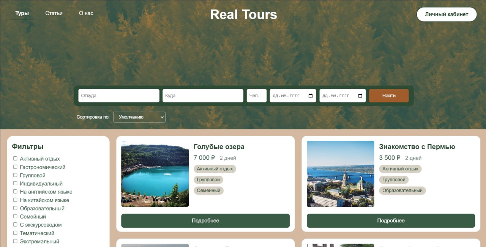

# Разработка информационной системы бронирования путешествий по Пермскому краю

Цель работы – разработка информационной системы, обеспечивающей удобное бронирование путешествий по Пермскому краю с возможностью выбора туров, просмотра информации о них и оформления бронирований.

